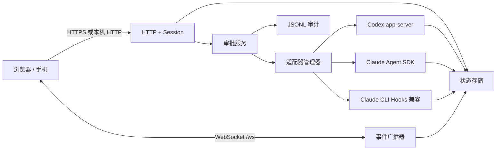

# AgentsView 架构说明

本文描述 AgentsView MVP 的实现边界。核心原则是：**一个本地服务、一份权威状态、一个受限审批通道**。先可靠地解决“我有哪些代理正在运行、谁在等我、我能否安全点一下允许 / 拒绝”，不把产品膨胀成远程 IDE 或通用任务编排平台。

## 1. 目标与非目标

### 目标

- 在桌面和手机浏览器统一查看 Codex / Claude 任务。
- 将不同代理归一化为“运行中、待审批、已完成”三个顶层状态。
- 实时推送状态变化，并能在事件丢失时恢复一致视图。
- 对已登记的审批请求执行幂等 `allow / deny`。
- 默认只暴露在本机，通过受控 HTTPS 入口提供手机访问。
- 以 JSONL 审计关键决策，方便排错和追溯。

### 非目标

- 不附加或接管任意已经运行的终端进程。
- 不提供完整 PTY、通用 shell、任意 stdin 或文件管理器。
- 不在 MVP 中加入数据库、Redis、消息队列、插件市场或复杂 RBAC。
- 不做多实例 / 多机器调度。
- 不把监控服务当成 Codex 沙箱、Claude 权限系统或操作系统权限的替代品。

## 2. 组件关系



### 单进程 Node 服务

HTTP API、静态 UI、WebSocket、状态存储、审批锁和适配器生命周期位于同一 Node.js 进程。这个结构有意保持简单：无需为个人工作站引入额外基础设施，审批请求与拥有它的代理子进程也天然同机。

### 浏览器客户端

客户端不是权威状态源。首次登录或重连时调用 `GET /api/bootstrap` 获取完整快照，此后消费 `/ws` 增量事件。客户端只发送任务创建参数与审批决策，不持有代理协议句柄。

### 适配器

适配器把供应商事件转换为统一状态，并保留供应商原始请求 ID 与生命周期所有权。审批服务只能把决策交回创建该请求的适配器实例。

## 3. 统一状态模型

顶层只保留三类：

| 状态 | 含义 |
| --- | --- |
| `running` | 代理正在工作、调用工具或等待供应商事件 |
| `waiting_approval` | 至少有一个尚未决策的审批请求 |
| `completed` | 任务已到终态；成功、失败、中断、取消由 outcome 区分 |

任务与审批分开存储。一个任务可以先后或同时拥有多个审批请求；不能把“任务 ID”误当成“审批 ID”。顶层计数始终从当前任务状态派生，不在 UI 中手动累加。

适配器事件可能乱序或重复，因此归一化层应满足：

- 终态不会被旧的运行事件覆盖。
- 重复事件不重复创建审批。
- 只有未决审批才把任务提升为 `waiting_approval`。
- 最后一个审批解决后，根据适配器真实状态回到 `running` 或进入 `completed`。
- 失败仍属于顶层 `completed`，同时保留错误 outcome；这样星图信息架构不会因每种终态无限扩张。

## 4. 实时协议与恢复

WebSocket 事件信封：

```json
{
  "version": 1,
  "serverId": "server-instance-id",
  "sequence": 42,
  "type": "task.updated",
  "at": "2026-07-17T10:00:00.000Z",
  "payload": {}
}
```

- `serverId` 在进程重启后变化，提示客户端丢弃旧增量假设。
- `sequence` 在单进程内严格递增。
- 客户端发现序号跳跃、serverId 变化或重连时，重新获取 `/api/bootstrap`，而不是猜测丢失事件。
- 心跳只用于检测连接，不承担业务状态。

这也是 PM2 只能运行单实例的原因之一。若未来需要横向扩展，必须先把权威状态、审批锁、事件序号和代理会话路由迁移到共享基础设施。

## 5. 审批事务

浏览器调用：

```text
PUT /api/approvals/:requestId/decision
```

请求只表达 `allow` 或 `deny`。命令、文件变更和工具输入来自服务端已有记录，不能由浏览器重新提交或改写。

处理顺序：

1. 验证登录会话、Origin 和请求格式。
2. 查找待审批记录，检查归属、状态和过期时间。
3. 为该 requestId 获取进程内锁，避免两个手机 / 标签页同时投递。
4. 写入 `decision_submitted` 审计记录。
5. 调用拥有请求的适配器，传入已验证决策。
6. 写入 `decision_delivered` 或失败记录，更新状态并广播事件。

幂等规则：

- 相同请求、相同决策的重试返回第一次处理结果，不再次调用适配器。
- 相同请求的相反决策是冲突，返回 `409`。
- 已过期或供应商已经解决的请求拒绝投递，可使用 `409` 或 `410` 表达陈旧状态。
- UI 不能用“按钮变灰”代替服务端锁；客户端状态只能改善体验，不能提供一致性。

服务端在适配器确认前区分“已提交”和“已投递”，避免网络或子进程错误造成虚假的“已批准成功”记录。

## 6. 登录与网络边界

### 本地令牌换会话

- 主访问令牌来自环境变量或首次启动时生成的本地文件。
- `POST /api/session` 使用恒定时间比较校验令牌。
- 成功后签发随机内存会话，并设置 `HttpOnly`、`SameSite=Strict` Cookie。
- 主令牌不写入 localStorage、不进入 URL query、不通过 WebSocket 参数传递。
- `DELETE /api/session` 使当前会话失效；服务重启也会清空内存会话。

### Origin 与 WebSocket

HTTP 状态变更和 WebSocket upgrade 都校验允许的 Origin。`AGENTSVIEW_PUBLIC_ORIGIN` 可声明逗号分隔的外部 HTTPS Origin。本机 Origin 始终与实际监听地址一致；不要使用宽泛 `*`。

### 监听策略

默认 `127.0.0.1:4173`。手机访问优先使用 Tailscale Serve，它能在 tailnet 内提供 HTTPS 并代理到回环端口。若使用 Caddy，TLS 在 Caddy 终止，AgentsView 仍只监听回环地址。

直接改成 `0.0.0.0` 会绕过回环隔离，让局域网设备直接触达审批入口，不作为推荐部署方式。更不能把明文端口直接映射到公网。

## 7. 审计与本地持久化

MVP 不需要数据库：

- 任务 / 审批快照写入 `AGENTSVIEW_DATA_DIR`，用于进程恢复与 UI bootstrap。
- 审批与关键生命周期事件追加写入按日期组织的 JSONL 审计文件。
- 自动生成的访问令牌保存在权限受限的本地文件。
- 登录会话、审批锁、WebSocket 连接和代理子进程句柄只存在内存中。

日志遵循最小化原则：

- 不记录访问令牌、Cookie、API key、Hook secret 或完整环境变量。
- 命令与工具输入只保留必要摘要并截断；敏感字段递归脱敏。
- 工作目录优先记录可辨识的末级名称或哈希，不无条件暴露完整用户路径。
- UI 对代理输出执行纯文本渲染，不使用未清洗 HTML。

JSONL 便于人工检查和备份，但不是防篡改账本。如果审批记录有合规要求，应把日志转发到具有访问控制与不可变保留策略的系统。

## 8. 适配器边界

### Codex app-server

AgentsView 启动并拥有一个 `codex app-server` 子进程，通过 stdio JSONL 完成初始化、thread / turn 生命周期、事件订阅与审批响应。

关键边界：

- 只有经 AgentsView 创建并由该 app-server 管理的任务具备完整实时控制。
- 另一个终端里独立启动的 Codex CLI 不属于此 app-server，无法可靠“扫描后接管”。
- Codex 的 sandbox 与 approvalPolicy 仍是最终安全边界；AgentsView 不应擅自改成 danger-full-access 或 never approve。
- app-server 通知可能没有严格 JSON-RPC `jsonrpc` 字段，适配器按官方实际 JSONL 消息处理，而不是套用要求严格字段的通用 RPC 库。

参考：[Codex app-server protocol](https://developers.openai.com/codex/app-server#protocol)。

### Claude Agent SDK

AgentsView 发起 SDK 查询，并在 `canUseTool` 权限回调中创建审批记录。回调保持等待，直到服务端收到决策或超时。

关键边界：

- 第三方 Agent SDK 接入需要 Anthropic API 凭据，不能假设复用个人 claude.ai 订阅登录。
- `allow` 必须返回适配器原先接收到的工具输入；浏览器无权提供替换输入。
- 超时、进程退出和服务关闭都必须显式拒绝或取消等待，不能悬挂 Promise。
- SDK 管理的任务可以完整控制；外部 CLI 会话不因此自动出现。

参考：[Claude Agent SDK user input & permissions](https://code.claude.com/docs/en/agent-sdk/user-input)。

### Claude Code CLI Hooks

Hooks 是兼容层，不是第二套完整控制协议。它可以在普通 CLI **启动前配置好 Hook** 的前提下，上报可观察事件，并让权限 Hook 短暂等待 Web 决策。

首次启动会生成独立的 `web/data/claude-hook-secret`（默认 data 目录相对 web/）。`npm run hooks:print` 只打印可合并的配置，不自动修改 `~/.claude/settings.json`，避免覆盖用户已有 Hooks；显式环境变量 `CLAUDE_HOOK_SECRET` 可用于外部密钥管理。

关键边界：

- 不能追回 Hook 安装前的历史，也不能接管已经显示的原生审批框。
- CLI 版本、启动参数与具体 Hook 事件会影响可观察范围；`--bare` 会跳过 Hooks。
- Hook 通道需共享密钥认证并限制来源。
- Hook 连接失败必须回退到 Claude Code 原生权限处理，而不是 fail-open。
- 不承诺任意文本回复、完整输出流或 PTY 能力。

参考：[Claude Code Hooks](https://code.claude.com/docs/en/hooks)。

## 9. PM2 生命周期

`web/ecosystem.config.cjs` 固定：

- `instances: 1`
- `exec_mode: fork`
- `wait_ready: true`
- 有限的启动与优雅关闭超时
- 内存上限触发重启

启动顺序：读取配置与本地状态 → 初始化审计 → 建立适配器能力 → 监听 HTTP / WS → 向 PM2 发送 `ready`。

关闭顺序：停止接受新任务 / 审批 → 拒绝或取消悬挂审批 → 关闭 WS → 请求适配器退出 → 落盘状态 → 退出进程。

PM2 重启会使内存会话失效，浏览器需要重新登录；这是降低长期会话泄漏风险的可接受取舍。

## 10. API 边界

MVP 对外只暴露以下业务面：

| 方法 / 通道 | 路径 |
| --- | --- |
| `POST` | `/api/session` |
| `DELETE` | `/api/session` |
| `GET` | `/api/bootstrap` |
| `POST` | `/api/tasks` |
| `PUT` | `/api/approvals/:requestId/decision` |
| `POST` | `/api/hooks/claude` |
| `GET` | `/health` |
| WebSocket | `/ws` |

新增 API 前先判断它是否破坏“只读状态流 + 受限决策通道”的边界。尤其是通用命令执行、任意文件写入与远程 stdin，不能作为“顺手加一个接口”进入 MVP。

## 11. 后续扩展门槛

只有出现真实需求后再引入：

- 多用户：需要身份提供方、RBAC、每条审批的主体归属和更严格审计。
- 多实例：需要共享状态、分布式锁、事件日志以及代理会话粘性路由。
- 跨机器代理：需要双向认证的 agent daemon、密钥轮换与离线语义。
- 自由文本回复：需要供应商级结构化 input request 支持、内容限制和上下文校验，不能复用审批接口。
- 公网部署：需要强身份认证、速率限制、CSRF / Origin 策略、反向代理信任边界和集中日志。

这些能力都不是简单 UI 按钮；在安全模型完成前，保持不实现比提供一个模糊的“远程控制”入口更可靠。
